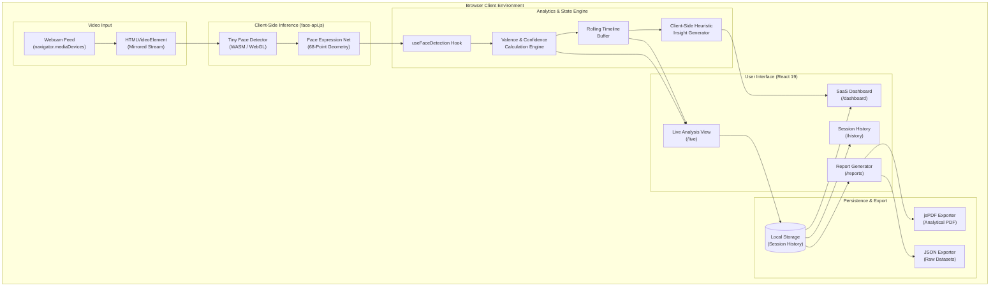

# 🧠 Emotion AI

<div align="center">

### Real-Time Facial Expression Intelligence Platform

**"See What Your Face Is Expressing — In Real Time."**

[](https://git.io/typing-svg)

<p align="center">
  <strong>Emotion AI</strong> is a browser-based computer vision application that analyzes facial expressions in real time and transforms detection results into interactive analytics, session insights, and visual reports.
</p>

<p align="center">
  <a href="https://emotion-ai-one.vercel.app/" target="_blank">
    
  </a>
  <a href="https://github.com/vikaskumar098/emotion-ai" target="_blank">
    
  </a>
</p>

<p align="center">
  
  
  
  
  
  
  
  
  
  
  
</p>

</div>

---

## 🚀 Live Demo

Experience the live application deployed directly in the browser:

**🔗 [https://emotion-ai-one.vercel.app/](https://emotion-ai-one.vercel.app/)**

> **Quick Start**: Open the link in Chrome, Edge, or Firefox, grant camera permission, and begin an interactive facial expression analysis session in seconds.

---

## 💻 Source Code

Access the full codebase, contribute, or star the repository:

**🔗 [https://github.com/vikaskumar098/emotion-ai](https://github.com/vikaskumar098/emotion-ai)**

---

## 📸 Product Preview

| **1. Marketing Landing Page** | **2. Live Analysis & Detection** |
| :---: | :---: |
| *High-conversion product showcase with interactive feature previews* | *Real-time camera feed with bounding boxes, confidence scoring & live graphs* |
|  |  |

| **3. AI Analytics Dashboard** | **4. Session History & Reports** |
| :---: | :---: |
| *Comprehensive SaaS dashboard tracking session KPIs and expression distribution* | *Historical sessions, chronological logs, and exportable PDF analytical reports* |
|  |  |

> *Tip: Replace preview placeholders with actual application captures using the paths `public/screenshots/`.*

---

## ✨ What is Emotion AI?

**Emotion AI** is an advanced browser-based computer vision platform engineered to detect, classify, and track human facial expressions in real time. 

Built on top of lightweight convolutional neural networks running client-side via WebGL, Emotion AI translates video frames from any standard webcam into structured temporal intelligence:

* **Live Expression Classification**: Continuously samples facial geometry across 7 standard expression classes.
* **Confidence & Expression Scoring**: Quantifies detection reliability alongside weighted valence scoring.
* **Temporal Distribution & Timelines**: Visualizes shifting expression trends over the lifecycle of a session.
* **Autonomous AI Observations**: Evaluates session dynamics to generate behavioral summaries and pattern flags.
* **Session Persistence & Historical Comparison**: Stores complete session telemetry locally for longitudinal review.
* **Exportable Analytical Reports**: Generates downloadable PDF summaries and raw JSON datasets.

---

## 🎯 The Problem

While modern computer vision models can detect facial landmarks and classify expressions with high speed, turning raw model outputs into meaningful user value presents significant challenges:

1. **Inscrutable Raw Outputs**: Standard deep learning demos output bare probability vectors (e.g., `neutral: 0.812, happy: 0.142`) without context or semantic explanation.
2. **Lack of Temporal Visualization**: A single-frame prediction gives no indication of how expressions evolve, fluctuate, or stabilize over a conversation or task.
3. **Absence of Session Tracking**: Most web demos discard data the moment the camera feed pauses, preventing users from reviewing patterns or measuring progress over time.
4. **Poor UI/UX in AI Tooling**: Academic or prototype implementations frequently lack responsive design, accessible charts, and export capabilities required for real-world utility.
5. **Data Privacy Concerns**: Cloud-based video processing architectures pose severe privacy risks by streaming personal biometric footage to remote servers.

---

## 💡 The Solution

Emotion AI bridges the gap between deep learning and production software engineering by uniting client-side inference with an intuitive SaaS analytics platform:

```
[ Webcam Stream ]
       ↓
[ Client-Side Computer Vision ] (TinyFaceDetector + 68 Landmark Net)
       ↓
[ 7-Class Facial Expression Classifier ]
       ↓
[ Real-Time Analytics & Scoring Engine ]
       ↓
[ Session Persistence (LocalStorage) ]
       ↓
[ Actionable AI Insights & PDF Reports ]
```

* **Zero Cloud Video Ingestion**: All facial detection and classification happens directly in the user's browser memory via WebGL hardware acceleration.
* **Holistic Analytics Pipeline**: Transforms single-frame detections into dynamic timeline charts, distribution rings, and confidence metrics.
* **Production-Grade Experience**: Complete with multi-session tracking, PDF report generation, dark mode aesthetics, and zero-state onboarding.

---

## ⚡ Core Features

### 🎥 Real-Time Camera Analysis
* Streams high-definition video directly from local input devices using `navigator.mediaDevices.getUserMedia`.
* Overlays aligned facial bounding boxes, real-time expression tags, and confidence percentages directly onto the canvas feed.
* Viewport-optimized interface designed to eliminate unnecessary vertical scrolling during active capture.

### 🧠 7-Class Facial Expression Classification
Accurately categorizes visible facial geometry into 7 core expression states:
* 😊 **Happy**
* 😐 **Neutral**
* 😲 **Surprised**
* 😢 **Sad**
* 😠 **Angry**
* 😨 **Fearful**
* 🤢 **Disgusted**

### 📊 Live Analytics Panel
* **Current Expression & Probability**: Displays active dominant class with individual confidence percentage.
* **Composite Expression Score**: Computes an aggregate valence metric (0–100) reflecting positivity and expressiveness.
* **Dominant Expression Tracker**: Continuously aggregates cumulative frame data to highlight dominant demeanor.
* **Active Face Counter**: Monitors single or multi-face presence within the camera frame.
* **Live Session Timer**: Tracks precise capture duration in seconds and minutes.

### 📈 Expression Distribution Charts
* Interactive Chart.js donut and bar distributions mapping the exact percentage breakdown of every detected expression throughout the session.

### 📉 Expression Timeline
* Real-time rolling timeline chart charting expression shifts and confidence variations across seconds of active monitoring.

### 🤖 Heuristic AI Insights
* Client-side analytical heuristics that evaluate expressiveness balance, emotional stability, high-frequency shifts, and fatigue markers from session telemetry.

### 🕒 Session Persistence & History
* Automatically records completed sessions with timestamp, total duration, dominant expression, average confidence, and complete distribution profiles.
* Dedicated **Session History** view with search, chronologically sorted cards, and detailed session inspection.

### 📄 Exportable Visual Reports
* Generates formatted, printable analytical PDF reports powered by `jsPDF`, including session summaries, KPI metrics, and expression distributions.
* Full raw JSON dataset export for researchers, data scientists, and developers.

### 📸 Instant Frame Snapshot
* Captures high-resolution canvas snapshots of the current camera frame tagged with expression metadata, confidence scores, and timestamps.

### 📱 Responsive SaaS Architecture
* Engineered with a responsive sidebar and layout supporting desktops, tablets, and mobile screens.

### 🔒 Privacy-Conscious Architecture
* Model inference executes strictly within the client's browser environment using WebGL. Video frames never leave the user's device, and data remains stored locally.

---

## 📊 AI Analytics Dashboard

The platform features an executive SaaS dashboard providing high-level telemetry across historical and active sessions:

```
┌────────────────────────────────────────────────────────────────────────┐
│  👋 Welcome Hero Banner           [ 🚀 Start New Live Analysis ]       │
├──────────────────┬──────────────────┬────────────────┬─────────────────┤
│ 📁 Sessions (12) │ 🎯 Avg Score(78%)│ 🌟 Dominant(😊)│ 🔒 Avg Conf(94%)│
├──────────────────┴──────────────────┴────────────────┴─────────────────┤
│ 📈 Expression Overview (Donut Chart) │ 📉 Temporal Trends (Line Chart) │
├──────────────────────────────────────┼─────────────────────────────────┤
│ 📋 Recent Sessions History           │ 🤖 AI Analytical Insights       │
├──────────────────────────────────────┼─────────────────────────────────┤
│ ⚡ Quick Actions (Reports / Settings)│ 🟢 System & Model Status        │
└──────────────────────────────────────┴─────────────────────────────────┘
```

* **4 Core KPI Metric Cards**: Aggregates total recorded sessions, mean expression score, primary dominant expression, and mean neural network confidence.
* **Expression Overview**: Visual breakdown comparing expressive vs. neutral balance.
* **Expression Trend Analysis**: Historical trend line evaluating score trajectory across recent runs.
* **Recent Sessions Drawer**: Quick-access listing of latest sessions with one-click drill-down.
* **AI Behavioral Insights**: Automated recommendations derived from cumulative aggregate data.
* **Zero-State Onboarding**: Helpful welcoming guide displayed automatically when no historical sessions exist yet.

---

## 🎥 Live Analysis Workflow

The real-time detection pipeline operates in a continuous client-side loop:

1. **Camera Initialization**: The client requests webcam permissions via HTML5 MediaDevices API.
2. **Model Loading**: Asynchronously loads pre-trained quantized weights for `TinyFaceDetector` and `FaceExpressionNet` from static assets.
3. **Face Localization**: Computes bounding box coordinates for all faces within each incoming video frame.
4. **Expression Classification**: Evaluates facial feature vectors against 68 landmark reference topologies to output normalized 7-class probability distributions.
5. **Telemetry Sampling**: Samples metrics at calibrated intervals to populate live charts without degrading browser render performance.
6. **Session Finalization**: On session end, stores immutable records into `localStorage` and generates exportable report artifacts.

> **Ethical Note & Disclaimer**: Emotion AI classifies visible facial geometry and expressions based on computer vision models. It should not be interpreted as a definitive psychological diagnosis or absolute indicator of internal emotional states.

---

## 🏗️ Architecture & How It Works



---

## 🛠️ Technology Stack

Emotion AI is built entirely with modern web technologies for maximum performance, maintainability, and responsiveness:

### Core Framework & Build
* **[React 19](https://react.dev/)**: Component architecture, custom hooks, and concurrent rendering.
* **[Vite 8](https://vitejs.dev/)**: Ultra-fast hot module replacement (HMR) and optimized build bundling.
* **[JavaScript (ES6+)](https://developer.mozilla.org/en-US/docs/Web/JavaScript)**: Native browser standard implementation.
* **[React Router DOM 7](https://reactrouter.com/)**: Client-side single-page routing (`/`, `/dashboard`, `/live`, `/history`, `/reports`, `/about`).

### Computer Vision & AI Models
* **[face-api.js](https://justadudewhohacks.github.io/face-api.js/docs/index.html)**: Browser port of TensorFlow models for face detection and expression recognition.
* **Tiny Face Detector**: Lightweight mobile-optimized neural network running via WebGL acceleration.
* **Face Expression Model**: Quantized classification network trained across 7 emotional expression categories.

### Data Visualization & Styling
* **[Chart.js 4](https://www.chartjs.org/)** & **[react-chartjs-2](https://react-chartjs-2.js.org/)**: Hardware-accelerated canvas charts (doughnuts, bars, and real-time temporal line plots).
* **[Tailwind CSS v4](https://tailwindcss.com/)**: Utility-first styling with custom glassmorphic dark-theme tokens.
* **[Framer Motion](https://www.framer.com/motion/)**: Fluid UI entrance animations and layout transitions.
* **[Lucide React](https://lucide.dev/)**: Clean, modern iconography across all application screens.

### Document & Data Export
* **[jsPDF](https://github.com/parallax/jsPDF)**: Client-side vector PDF document generation for downloadable analytical session dossiers.
* **[React Hot Toast](https://react-hot-toast.com/)**: Non-blocking toast notifications for system events and snapshot confirmations.

---

## 📂 Project Structure

```
emotion-ai/
├── public/
│   ├── favicon.svg              # Application brand icon
│   ├── icons.svg                # System SVG sprite icons
│   └── models/                  # Pre-trained neural network weights
│       ├── face_expression/     # Expression recognition model shards & manifest
│       └── tiny_face_detector/  # Tiny face detector model shards & manifest
├── src/
│   ├── assets/                  # Brand graphics & visual assets
│   ├── components/
│   │   ├── dashboard/           # Specialized dashboard widget components
│   │   │   ├── AIInsightsCard.jsx
│   │   │   ├── ExpressionOverview.jsx
│   │   │   ├── ExpressionTrend.jsx
│   │   │   ├── LiveAnalysisCard.jsx
│   │   │   ├── MetricCards.jsx
│   │   │   ├── OnboardingDashboard.jsx
│   │   │   ├── QuickActions.jsx
│   │   │   ├── RecentSessions.jsx
│   │   │   ├── SystemStatus.jsx
│   │   │   └── WelcomeHero.jsx
│   │   ├── ui/                  # Reusable low-level UI primitives
│   │   ├── AIInsights.jsx       # Real-time insight engine card
│   │   ├── AnalyticsPanel.jsx   # Live session metric panel
│   │   ├── CameraView.jsx       # Webcam video feed with canvas detection overlay
│   │   ├── EmotionChart.jsx     # Distribution donut and breakdown bars
│   │   ├── Header.jsx           # Dynamic application top navigation
│   │   ├── MobileNav.jsx        # Bottom navigation bar for mobile viewports
│   │   ├── MultiFacePanel.jsx   # Multi-face indicator
│   │   ├── PrivacyModal.jsx     # Privacy architecture modal dialog
│   │   ├── SessionSummary.jsx   # Post-session summary banner
│   │   ├── SettingsModal.jsx    # Config modal with JSON export & data clearing
│   │   ├── Sidebar.jsx          # Desktop navigation sidebar
│   │   ├── SnapshotModal.jsx    # Captured frame preview dialog
│   │   └── TimelineChart.jsx    # Real-time temporal line chart
│   ├── hooks/
│   │   ├── useFaceDetection.js  # Core face-api lifecycle, canvas rendering & loop
│   │   └── useSession.js        # Live timer, telemetry collection & recording
│   ├── pages/
│   │   ├── About.jsx            # Product information & model architecture docs
│   │   ├── Dashboard.jsx        # Primary AI SaaS metrics dashboard
│   │   ├── History.jsx          # Historical session list, filters & inspections
│   │   ├── Landing.jsx          # Premium marketing landing page
│   │   ├── LiveAnalysis.jsx     # Viewport-fitted real-time analysis cockpit
│   │   └── Reports.jsx          # Comprehensive analytical reports & PDF generator
│   ├── services/
│   │   └── sessionService.js    # LocalStorage CRUD & statistical aggregation
│   ├── utils/
│   │   ├── expressionUtils.js   # Expression colors, labels, weights & icons
│   │   ├── reportGenerator.js   # jsPDF analytical dossier generator
│   │   └── storage.js           # Low-level storage wrapper
│   ├── App.jsx                  # Route shell and layout configuration
│   ├── index.css                # Tailwind CSS v4 root stylesheet & theme tokens
│   └── main.jsx                 # React root mounting entry point
├── package.json
├── tailwind.config.js
├── vite.config.js
└── README.md
```

---

## ⚡ Getting Started

Follow these steps to run Emotion AI locally on your development machine:

### Prerequisites
* **Node.js** (v18.0.0 or higher recommended)
* **npm** (v9.0.0 or higher) or **yarn** / **pnpm**
* A working webcam or integrated camera connected to your system
* A modern browser supporting WebGL (Google Chrome, Microsoft Edge, Brave, Firefox, or Safari)

### 1. Clone the Repository
```bash
git clone https://github.com/vikaskumar098/emotion-ai.git
cd emotion-ai
```

### 2. Install Dependencies
```bash
npm install
```

### 3. Verify Model Assets
Verify that the model weights exist in `public/models/`:
```bash
# Verify directory contents
ls public/models/
# Should output: face_expression  tiny_face_detector
```

### 4. Start the Local Development Server
```bash
npm run dev
```
Open your browser and navigate to:
```
http://localhost:5173
```

### 5. Build for Production
To generate an optimized production bundle:
```bash
npm run build
```
Preview the production build locally:
```bash
npm run preview
```

---

## 🔒 Privacy & Security Architecture

Emotion AI was designed from the ground up with strict privacy principles:

* **In-Browser Execution**: All computer vision model inference is performed client-side using WebGL shaders.
* **No Video Streaming**: Raw camera frames from your webcam are processed directly in GPU/browser memory and are never uploaded or streamed over the internet.
* **Local Data Persistence**: Session metrics and historical records are stored strictly in the client's browser `localStorage`.
* **Zero Account Tracking**: No tracking cookies, third-party analytics trackers, or mandatory authentication gates.
* **User Control**: Complete capability to export all telemetry in standard JSON format or clear all stored sessions with a single click.

---

## ⚖️ Ethical Considerations & Guidelines

Facial expression detection is a technical classification of visible muscle movements and geometric arrangements across the mouth, eyebrows, eyes, and jaw.

* Visible facial expressions do not always correspond directly or consistently with internal psychological emotions. Cultural variations, individual mannerisms, and physical contexts influence visible demeanor.
* Emotion AI is intended for informational, educational, and analytical evaluation. It is **not** designed or certified for medical diagnosis, clinical psychological assessment, or high-stakes employment screening decisions.

---

## 🤝 Contributing

Contributions, feedback, and suggestions are welcome!

1. Fork the Project (`https://github.com/vikaskumar098/emotion-ai`)
2. Create your Feature Branch (`git checkout -b feature/AmazingFeature`)
3. Commit your Changes (`git commit -m 'Add some AmazingFeature'`)
4. Push to the Branch (`git push origin feature/AmazingFeature`)
5. Open a Pull Request

---

## 📜 License

This project is licensed under the **MIT License** — see the [LICENSE](LICENSE) file for details.

---

## 👨‍💻 Author

**Vikas Kumar**
* GitHub: [@vikaskumar098](https://github.com/vikaskumar098)
* Live Application: [https://emotion-ai-one.vercel.app/](https://emotion-ai-one.vercel.app/)

<div align="center">

**Built with ❤️ for real-time facial intelligence.**

</div>
