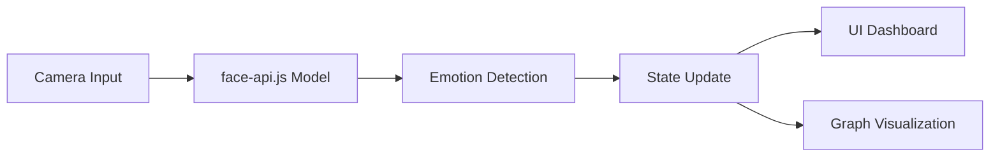

# 😎 AI Emotion Dashboard

  

---

  
  
  
  
  

  
  

---

## 🌐 Live Demo

---

## 📂 GitHub Repo

---

## 🎯 Problem

> Understanding human emotions through traditional methods is difficult...

❌ No real-time analysis  
❌ No visual feedback  
❌ Hard to track engagement  

---
## 💡 Solution

✨ Detect facial expressions in real-time  
✨ Convert emotions into live data & graphs  
✨ Provide visual + interactive dashboard  

---

## ⚡ Features

🎥 Live Camera Emotion Detection  
😊 Real-Time Emotion Analysis  
📊 Dynamic Emotion Graph  
📈 Animated Stats (Live %)  
🧊 Glassmorphism UI + Animations  
⚡ Fast & Lightweight (Runs in Browser)  

## 🧠 How It Works

---

## 🛠 Tech Stack

* ⚛️ React.js
* 🧠 face-api.js
* 📊 Chart.js
* 🎨 Tailwind CSS
* 🌐 Vercel

---

## 🚀 Future Scope

* 🧠 Attention Detection
* 📊 Emotion History Timeline
* 🤖 AI Insights
* 📱 Mobile Optimization

---

## 👨‍💻 Developer

**Vikas Kumar** 🚀
B.Tech IT | Cloud & Full Stack Developer

---

## ⭐ Support

If you like this project:

* ⭐ Star the repo
* 📢 Share it

---

## 🔥 Tagline

> ✨ “Don’t just detect emotions… understand them in real-time.”
